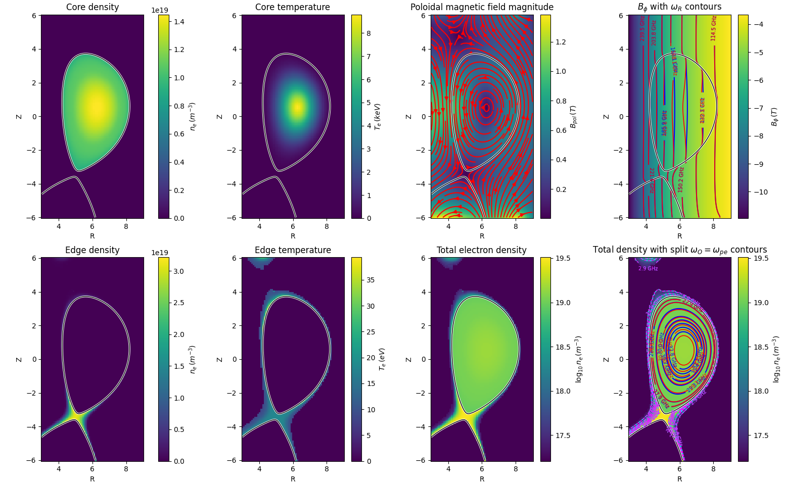

# **IMASHelper — IMAS Access & Hydrodynamic Mapping Layer**

## **Overview**

**IMASH** is a lightweight C++ library that extracts plasma and machine data from IMAS (Integrated Modelling & Analysis Suite) and maps it into solver-ready data structures.

It is designed as a **bridge layer** between IMAS and numerical solvers (e.g. AMReX-based FDTD codes), while preserving a **Python-verifiable workflow** via file outputs.



---

## Running the IMASH test executable

The executable requires the IMAS path and a time (in seconds):

```bash
./imash <imas_path> <time> [output_dir]
```

Example:

```bash
./imash ~/iter/134174/117/ 60.0 ./
```

This will read IMAS data at `t = 60.0 s` and write output files to the current directory.

## **What IMASH Does**

IMASH performs three core operations:

### 1. **Data Extraction from IMAS**

Reads data from standard IMAS IDS:

- `core_profiles`
- `equilibrium`
- `edge_profiles (GGD)`
- `wall`

Example:
```cpp
IdsNs::IDS ids;
ids.open("imas:hdf5?path=...", OPEN_PULSE);
```

---

### 2. **Mapping to Physical Space**

IMAS data is not directly solver-ready. IMASH reconstructs physical fields:

#### **Core plasma (structured grid)**

Maps 1D profiles → 2D equilibrium grid:

$$
\rho(R,Z) = \sqrt{\frac{\psi(R,Z)-\psi_{\text{axis}}}{\psi_{\text{bnd}}-\psi_{\text{axis}}}}
$$

- Produces:
  - $n_e(R,Z)$
  - $T_e(R,Z)$
- Uses interpolation in $\rho$

---

#### **Edge plasma (unstructured mesh)**

- Extracts cell-centered data from GGD mesh
- Reconstructs:
  - $(R,Z)$ from node geometry
  - $n_e, T_e$ from field values

Optional:
- Projection to equilibrium grid via $(\rho,\theta)$

---

#### **Magnetic field**

From equilibrium:

- $B_R(R,Z)$
- $B_Z(R,Z)$
- $B_\phi = B_T \frac{R_0}{R}$

---

#### **Wall geometry**

- Extracts limiter and vessel contours
- Produces polylines in $(R,Z)$

---

### 3. **Packaging into Solver-Ready Structures**

IMASH builds clean C++ objects:

- `PlasmaData`
- `WallData`
- `EdgeCellPoint`
- `EqGrid2D`

These are **independent of AMReX or any solver**.

---

## **Design Philosophy**

### **Separation of concerns**

| Layer   | Responsibility                    |
|--------|----------------------------------|
| IMASH  | Read & reconstruct physics       |
| Solver | Discretization & time evolution  |

IMASH:
- does **not** know about `MultiFab`, MPI, or GPUs
- produces **pure C++ data structures**

---

### **Dual workflow**

IMASH supports:

#### ✅ Debug / validation mode
Write outputs to file:
```cpp
WriteCore2D(ids, time, "core.dat");
WriteEdge2D(ids, time, "edge.dat");
```

Used with Python:
```python
plt.pcolormesh(...)
plt.tricontourf(...)
```

#### ✅ Production mode
Return in-memory structures:
```cpp
PlasmaData plasma = ExtractPlasmaData(ids, time);
```

---

## **Data Conventions**

### **Structured grid (equilibrium)**

Flattening convention:

$$
k = j \cdot n_R + i
$$

- $i$: radial index  
- $j$: vertical index  

---

### **Edge data**

- Stored as unstructured points  
- No flattening  
- Derived from mesh connectivity  

---

### **Units**

- Length: meters  
- Density: $\text{m}^{-3}$  
- Temperature: eV  
- Magnetic field: Tesla  

---

## **Typical Usage**

```cpp
IdsNs::IDS ids;
ids.open("imas:hdf5?path=...", OPEN_PULSE);

double time = 60.0;

// Full plasma extraction
PlasmaData plasma = ExtractPlasmaData(ids, time,
                                      true,  // core
                                      true,  // B field
                                      true,  // edge projection
                                      true,  // merge density
                                      true); // merge temperature

// Debug output
WriteCore2D(plasma, "core.dat");
WriteBfield2D(plasma, "bfield.dat");
```

---

## **Integration with Solvers (e.g. AMReX)**

IMASH is designed to feed directly into simulation codes:

```cpp
PlasmaData plasma = ExtractPlasmaData(ids, time);
FillMultiFabFromPlasma(plasma, ...);
```

- IMASH handles physics reconstruction  
- Solver handles:
  - domain decomposition  
  - GPU transfer  
  - time stepping  

---

## **Supported Features**

- ✅ Core profile mapping  
- ✅ Edge GGD reconstruction  
- ✅ Edge → grid interpolation ($\rho,\theta$)  
- ✅ Magnetic field extraction  
- ✅ Wall geometry extraction  
- ✅ Python-compatible outputs  

---

## **Future Extensions**

- STL wall import (CAD geometry)  
- Reflectometer / antenna geometry  
- 3D toroidal reconstruction  
- Direct AMReX ingestion utilities  
- Time-dependent IMAS sequences  

---

## **Dependencies**

- IMAS C++ Access Layer (`ALClasses`)  
- C++17  
- Standard library only (no solver dependency)  

---

## **Why IMASH Exists**

IMAS provides rich physics data, but:

- data is **heterogeneous**  
- grids are **not solver-ready**  
- edge uses **unstructured meshes**  

IMASH solves this by providing:

> **A consistent, physics-aware mapping from IMAS → simulation-ready fields**

---

## **Summary**

IMASH is a **thin but critical layer** that:

- converts IMAS data into physical fields  
- unifies core + edge descriptions  
- remains solver-agnostic  
- preserves validation through file output  
